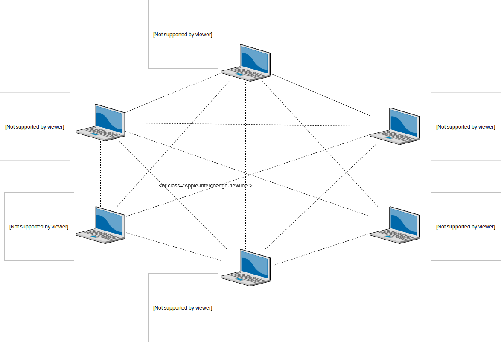

# Note 9-2

## System design

Hard code ID and IP in config files. Every node config files (json?) like

    [
        {
            "ID": "1",
            "IP": "192.168.0.1"
        },
        {
            "ID": "2",
            "IP": "192.168.0.2"
        }
    ]

Every node will have a deamon server process to handle the grep request from other nodes.
There will also be a command line tool for user to grep log from all alive nodes.
Below is how the network would look like.

 

## File Structure

Below is the file structure of the repo.

    ├── README.md
    ├── distributed_grep.go
    ├── grep.go
    ├── logs
    │   └── example_logs.i.log
    ├── server.go
    └── tests
        └── example_test.go
